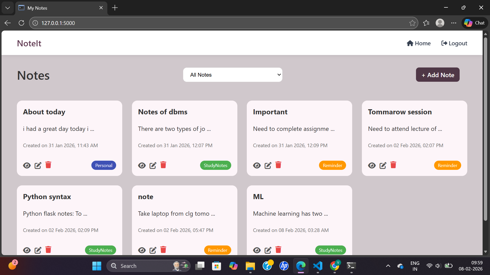
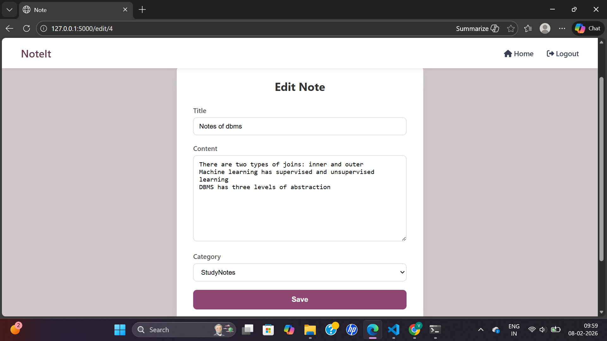

# 📝 Smart Notes Application

A Flask-based notes management web application that uses Machine Learning to automatically predict note categories. Users can edit the predicted category while editing the note. The application also includes user authentication and category-based note filtering.

---

## 🚀 Features

- User login and registration using WTForms
- Add, edit, view, and delete notes
- Automatic note category prediction using ML
- Editable category on edit page
- Filter notes by category
- MySQL database integration
- Clean and simple UI
- Modular Flask structure using routes (Blueprints)

---

## 🧠 Machine Learning

- The ML model predicts the note category based on the note content
- Prediction happens when a note is saved
- The predicted category can be changed by the user later
- ML logic is separated inside the `ml/` folder

### 📌 Supported Categories
- **Personal**
- **Study Notes**
- **Reminder**

---

## 🛠 Tech Stack

- **Backend:** Python, Flask
- **Database:** MySQL
- **Machine Learning:** Scikit-learn (NLP)
- **Forms & Validation:** Flask-WTF (WTForms)
- **Frontend:** HTML, CSS, Jinja Templates
- **Version Control:** Git & GitHub

---

## 📂 Project Structure

```text
project/
├── run.py  # Application entry point
├── app/
│ ├── init.py  # App factory & configuration
│ ├── models.py  # Database models
│ ├── routes/
│ │ ├── auth.py  # Login, register, logout
│ │ └── notes.py  # Notes CRUD & filtering
│ ├── ml/
│ │ ├── label_encoder.pkl  
│ │ ├── vectorizer.pkl 
│ │ └── lr_model.pkl  
│ └── forms.py  # WTForms definitions
│
├── templates/
│ ├── base.html
│ ├── register.html
│ ├── login.html
│ ├── notes.html
│ ├── note_form.html
│ └── note_display.html
│
├── static/
│   ├── css/
│   │   └── style.css
│   └── js/
│       └── script.js
│
├── screenshots/ 
├── requirements.txt
├── README.md
└── .gitignore


---

```

## 📸 Screenshots

### Login Page


### Notes Dashboard


### Edit Note


### View Note


---

## ⚙️ Setup Instructions

#### 1. Clone the Repository
```bash
git clone https://github.com/Vedashri05/YOUR_REPO_NAME.git
cd YOUR_REPO_NAME

#### 2. Create and Activate Virtual Environment

```bash
python -m venv venv

Activate:

Windows:

venv\Scripts\activate

macOS / Linux:

source venv/bin/activate

3️⃣ Install Dependencies
pip install -r requirements.txt

4️⃣ Create .env File
Create a .env file in the project root and add:

SECRET_KEY=your_secret_key
DB_USER=root
DB_PASSWORD=your_mysql_password
DB_HOST=localhost
DB_NAME=notes_db

5️⃣ Create MySQL Database
CREATE DATABASE notes_db;

6️⃣ Run the Application
python run.py

Open your browser and visit:
http://127.0.0.1:5000/